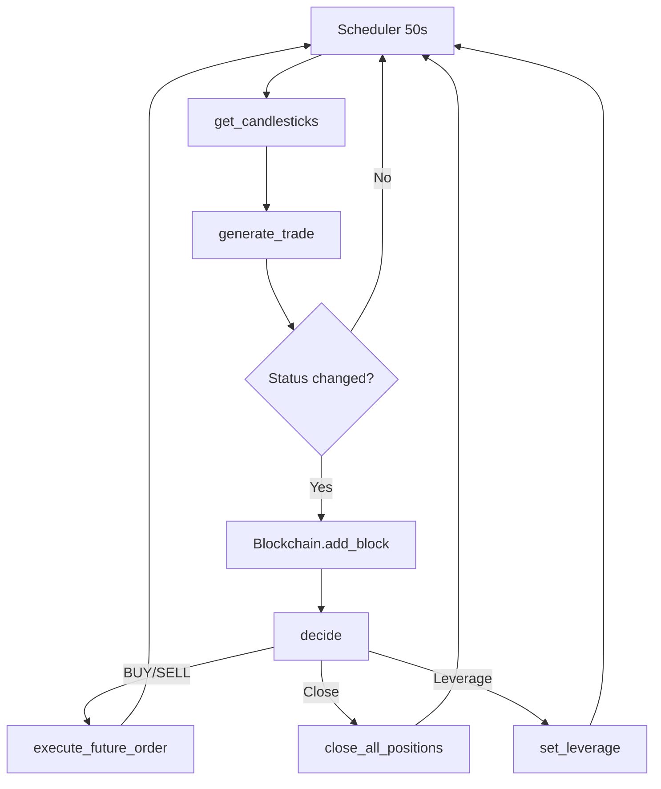

# rkd-high-frequency-trading

> Algorithmic trading platform in **Rust** for automated operations on **Binance Futures** (BTCUSDT). The project exposes a REST API for external control and uses an internal blockchain to immutably record the entire decision history.

---

## Table of Contents

* [Overview](#overview)
* [High‑Level Flow](#high-level-flow)
* [Trading Strategy](#trading-strategy)
* [Software Architecture](#software-architecture)
* [Tech Stack](#tech-stack)
* [Installation](#installation)
* [Configuration](#configuration)
* [Running](#running)
* [HTTP API](#http-api)
* [Security Best Practices](#security-best-practices)
* [Roadmap](#roadmap)
* [Contributing](#contributing)
* [License](#license)

---

## Overview

This repository implements an **asynchronous trading bot** capable of:

1. Collecting Binance candlesticks every 50 s.
2. Computing moving averages, logarithmic price zones, and determining the market *bias* (Bullish, Bearish, None).
3. Storing every decision in an in‑memory **blockchain**, ensuring data integrity.
4. Taking automatic actions:

   * Opening LONG/SHORT positions.
   * Closing all positions.
   * Adjusting the symbol leverage.
5. Exposing **REST endpoints** for monitoring and manual control.

> **Disclaimer** This project is for educational purposes only. Use it at your own risk.

---

## High‑Level Flow



---

## Trading Strategy

* **Moving Averages**

  * `CMA` — moving average of the last **200** candles (excluding the first 24 of the 224 collected).
  * `OMA` — moving average of the original 200 candles (for comparison).
* **Bias**

  * `Bullish` if `CMA > OMA`; `Bearish` if `CMA < OMA`; `None` otherwise.
* **Price Zones (1 – 7)**
  Logarithmic ranges calculated from `max(high)` and `min(low)` of the 200 analysed candles.
* **State Machine**
  Transitions between `TradeStatus` values (e.g., `PrepareZone1`, `InZone3`, `TargetLongZone7`) define **triggers** for market orders or leverage adjustments.
* **Risk Management**

  * Automatic leverage 1× or 2× according to *(Bias, TradeStatus)* pairs.
  * Notional check (≥ 20 USDT) before any order.

---

## Software Architecture

* **Actix‑Web** as the asynchronous HTTP server.
* **Tokio** for scheduling and concurrent tasks.
* **Reqwest** + **HMAC‑SHA256** for authenticated Binance calls.
* **Once‑Cell** for singletons (settings, credentials, blockchain).
* **Mutex** around the blockchain to guarantee consistency across threads.

Project layout:

```
├── src
│   ├── api.rs            # REST handlers
│   ├── balance.rs        # Futures balance
│   ├── blockchain.rs     # Internal blockchain
│   ├── client.rs         # Generic Binance queries
│   ├── config.rs         # Settings.toml reader
│   ├── credential.rs     # Loads API KEY/SECRET
│   ├── decide.rs         # Decision state machine
│   ├── dto.rs            # Data types and enums
│   ├── leverage.rs       # Leverage adjustment
│   ├── order.rs          # Order execution/closing
│   ├── schedule.rs       # Asynchronous scheduler
│   ├── trade.rs          # Technical calculations
│   └── main.rs           # Actix‑Web bootstrap
└── config/Settings.toml  # Pair configuration
```

---

## Tech Stack

| Category          | Technologies        |
| ----------------- | ------------------- |
| **Language**      | Rust (stable)       |
| **Web**           | Actix‑Web, Reqwest  |
| **Async**         | Tokio               |
| **Serialization** | Serde / serde\_json |
| **Cryptography**  | hmac, sha2, hex     |
| **Configuration** | config crate        |
| **Testing**       | cargo test (unit)   |

---

## Installation

```bash
# 1. Clone the repository
$ git clone https://github.com/<user>/rkd-high-frequency-trading.git
$ cd rkd-high-frequency-trading

# 2. Install the Rust toolchain (if you haven’t)
$ curl --proto '=https' --tlsv1.2 -sSf https://sh.rustup.rs | sh
$ rustup default stable

# 3. Build
$ cargo build --release
```

### Prerequisites

| Tool    | Minimum version |
| ------- | --------------- |
| Rust    | 1.78            |
| OpenSSL | 1.1             |

---

## Configuration

1. **Environment variables**

   ```bash
   export BINANCE_API_KEY="<your-api-key>"
   export BINANCE_API_SECRET="<your-api-secret>"
   ```
2. **`config/Settings.toml`** (example)

   ```toml
   [binance]
   base_url      = "https://api.binance.com/api/v3"
   future_url    = "https://fapi.binance.com/fapi/v1"
   future_url_v2 = "https://fapi.binance.com/fapi/v2"
   symbol        = "BTCUSDT"
   interval      = "1m"
   limit         = 224
   leverage      = 1
   ```

> **Tip** Keep keys and secrets out of version control (`.gitignore`).

---

## Running

```bash
# Start the server
$ cargo run --release

# Expected output
Server running at http://localhost:8080
```

---

## HTTP API

| Method   | Route                 | Description                                           |
| -------- | --------------------- | ----------------------------------------------------- |
| **GET**  | `/trades/start`       | Start the scheduler (50 s loop).                      |
| **POST** | `/trades/order`       | Send manual order *(body: {"side":"BUY" \| "SELL"})*. |
| **GET**  | `/trades/chain`       | Return the full blockchain.                           |
| **GET**  | `/trades/last`        | Latest trade recorded.                                |
| **GET**  | `/trades/balance`     | USDT balance in the Futures wallet.                   |
| **POST** | `/trades/order/close` | Close **all** open positions.                         |
| **PUT**  | `/leverage`           | Adjust leverage *(body: {"value": 1 \| 2})*.          |
| **POST** | `/scheduler/stop`     | Stop the scheduler.                                   |
| **GET**  | `/health`             | Simple health‑check.                                  |

The complete specification (payloads, response samples) will be available soon in [`docs/api_spec.md`](docs/api_spec.md).

---

## Security Best Practices

* Store Binance keys in a **secret manager** or protected environment variables.
* Use a **firewall**/VPN to restrict request IPs.
* Test on a **testnet account** before going live.
* Set leverage/notional limits aligned with your risk profile.

---

## Roadmap

* [ ] Persist the blockchain in SQLite/PostgreSQL.
* [ ] Implement an offline back‑tester.
* [ ] Add alerts via Telegram/Slack.
* [ ] Dockerfile + Helm Chart for Kubernetes deployment.

---

## Contributing

1. Fork the project.
2. Create a branch (`git checkout -b feature/MyFeature`).
3. Commit your changes (`git commit -m 'feat: My new feature'`).
4. Push to the branch (`git push origin feature/MyFeature`).
5. Open a **Pull Request**.

> Respect `rustfmt` formatting and run `clippy` before opening PRs.

---

## License

Distributed under the **MIT License**. See the [`LICENSE`](LICENSE) file for details.

---

> Built with ❤ in Rust — performance, safety and fun.
